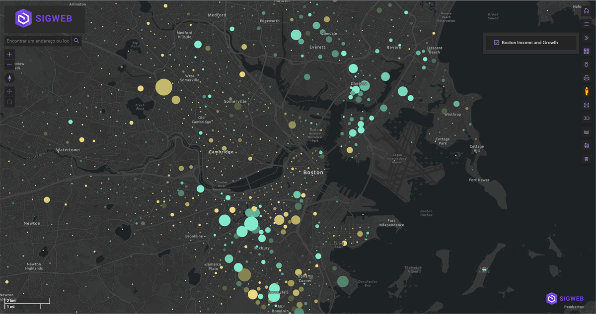

## 🚀 SigWeb Start - <i>Using Arcgis API for Javascript</i>

  <i>
   Este projeto é um modelo para criação de um Sistema de Informações Geográficas web que usa
    ⚡ <a href="https://developers.arcgis.com/javascript/latest/sample-code/">Arcgis API for Javascript</a>
    em sua implementação.
  </i>

<h3>🏆 Principais Widgets Disponibilizados <i>(Ferramentas de Interface)</i> </h3>
-Lista de Camadas
-Galeria de Mapas Base
-Ferramenta de Impressão
-Google Street View
-Switch View (2D and 3D)
-Busca Rápida
-Measurement
-Ferramenta de Coordenandas
-Legendas
-Botão Home - Initial Extent
-Botões de Zoom In e Zoom Out
-Bússola
-3D Rotate and Move
-Barra de Escala
-UI
